# pw-emulator
A project that seeks to emulate the server of Perfect World.

Abandoned project. Was fun while it lasted. I started this before I went to university, but time was scarse and the market for an emulator died, so I abandoned the project a short while after.

# What works

Login works, character database works, item deletion/rentention, basic map engine, watermaps/heightmap checking, a few other small things.

This should basically be seen as a proof-of-concept to implementing a PW emulator. Many approaches I took should be seen as controversial at best.

# What doesn't work

Pretty much everything else. Also, I have not included my MPPC compressor in this repo, since I do not want it public yet. 

# Pretty pictures

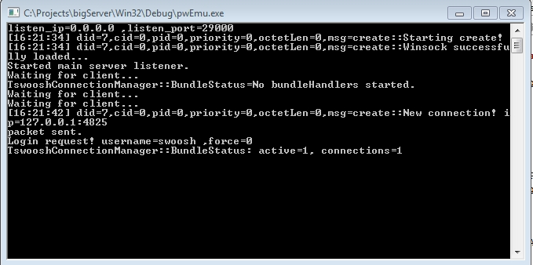
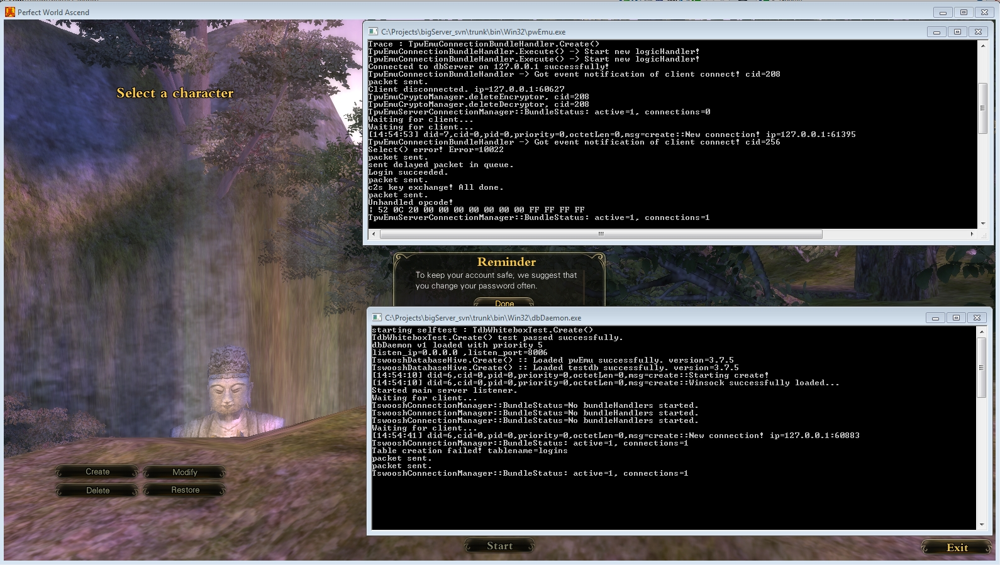
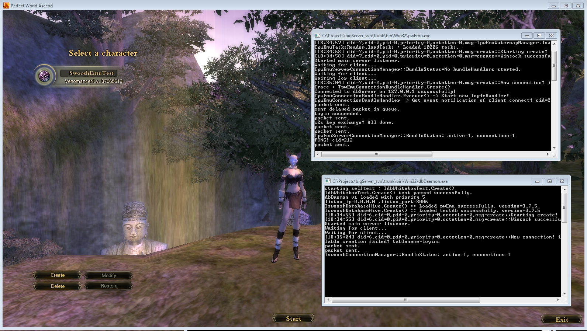
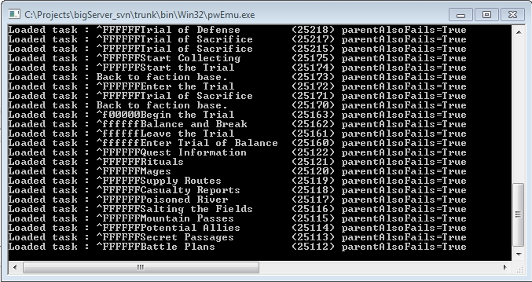
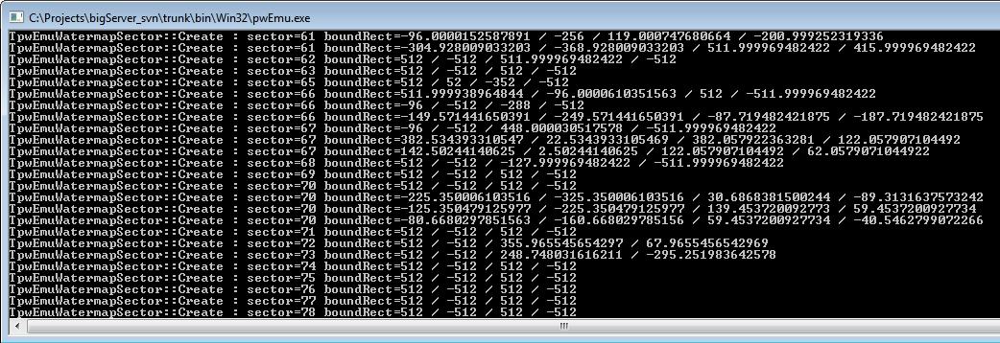
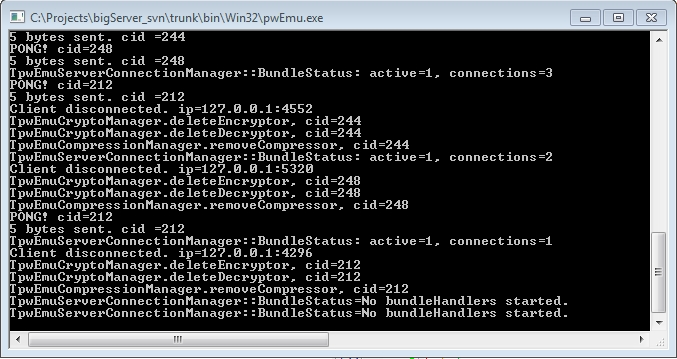
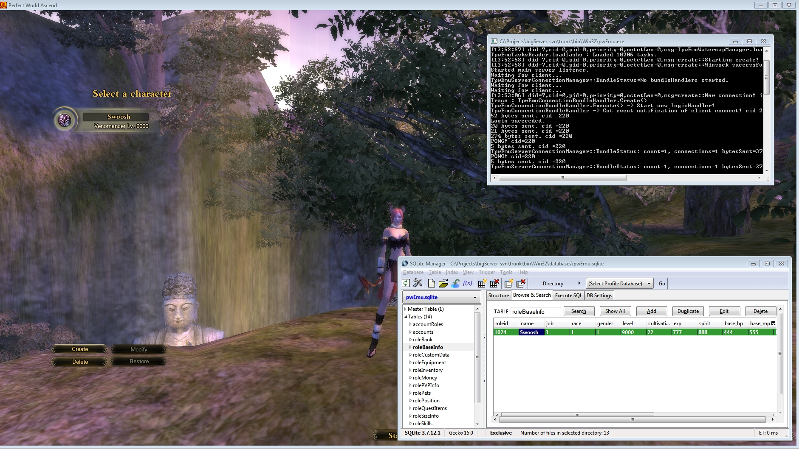
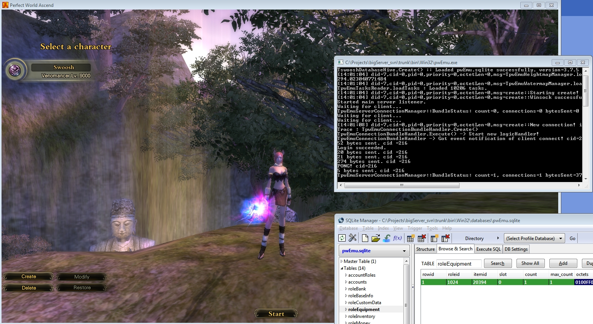
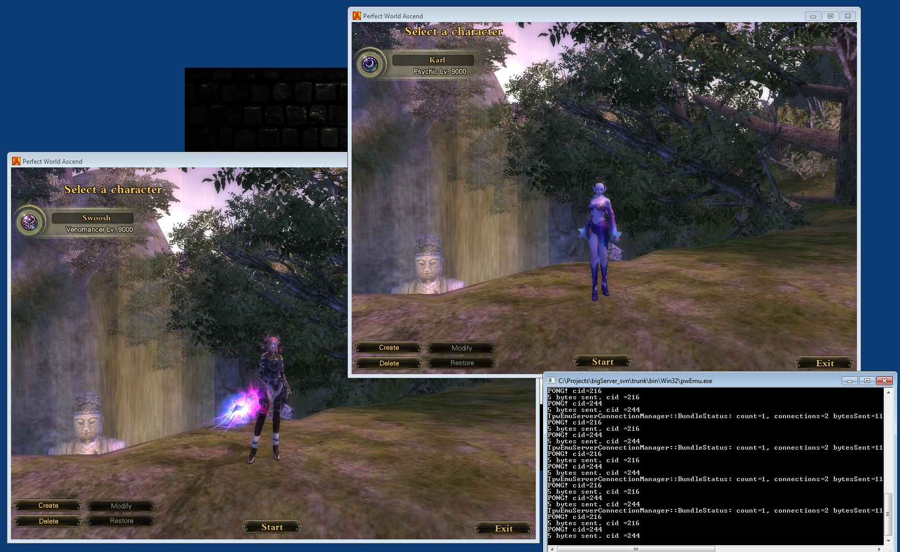
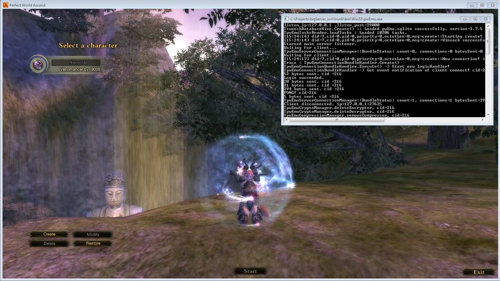
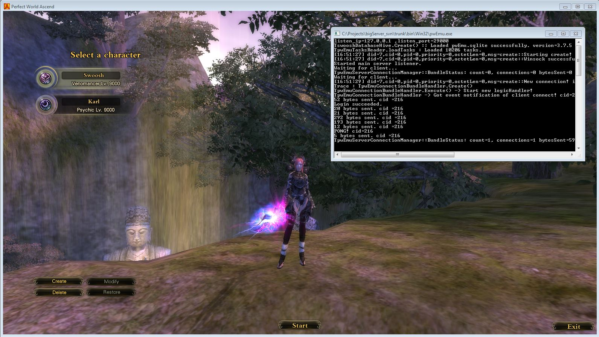
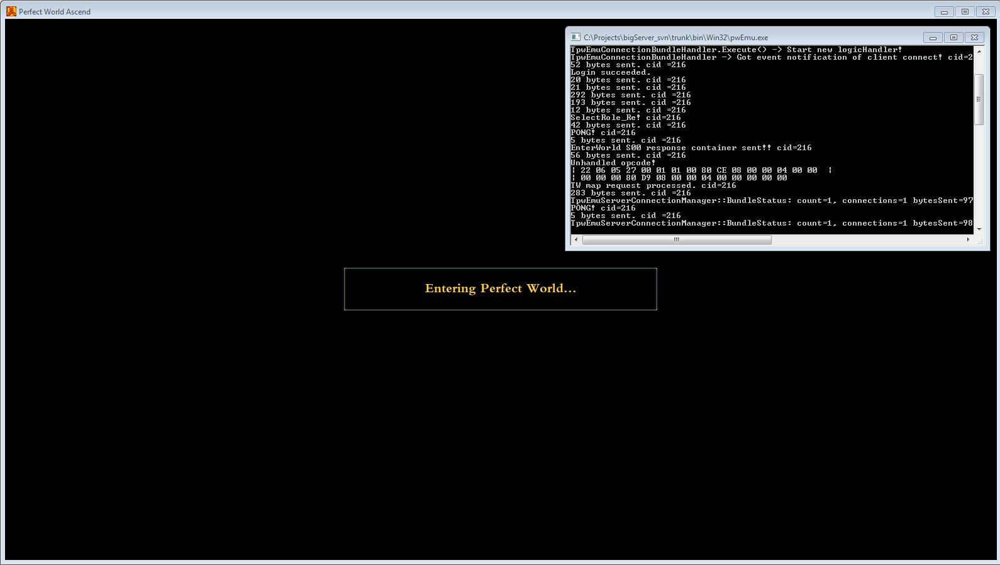
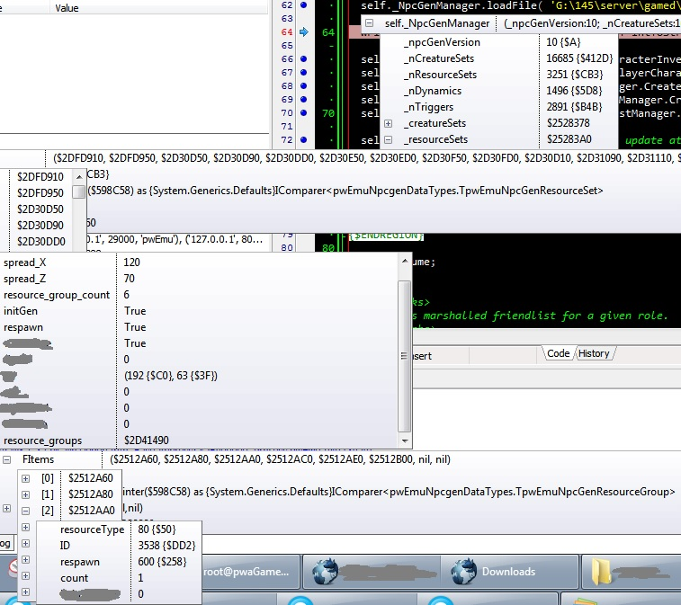

Use this as-is, but do credit me somewhere where nobody will ever read it anyways, such as a readme.txt.

Greetings
